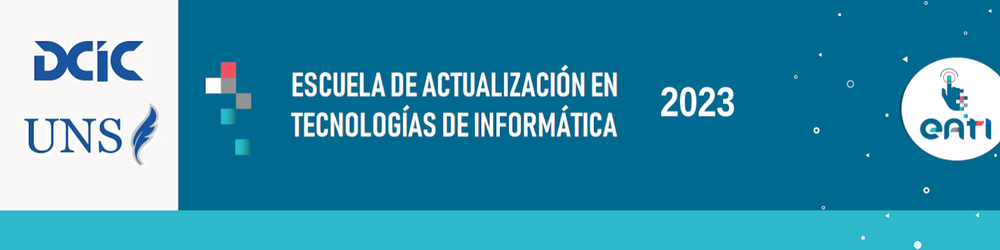

</img>

[🇪🇸 Leer en español](README_ES.md)

### EATI 2023 My Action

In this repository we create our own action to later be used from this other repository.

___

This repository was created for the course"**DevOps: tu pipeline de CI/CD con Github Actions**" of the "Escuela de Actualización en Tecnologías de la Información" (EATI 2023) in charge of the [Departamento de Ciencias e Ingeniería Informática (DCIC)](https://cs.uns.edu.ar/) of the [Universidad Nacional del Sur (UNS)](https://uns.edu.ar/).

___

The repositories that we created during the course were the following:
- https://github.com/matichewer/eati2023-ci-cd-first-steps
- https://github.com/matichewer/eati2023-pipeline
- https://github.com/matichewer/eati2023-my-action/
- https://github.com/matichewer/eati2023-test-my-action
